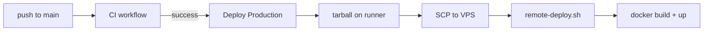

# CI/CD آگهی‌گرام

این سند توضیح می‌دهد GitHub Actions پروژه چه کارهایی انجام می‌دهد و deploy production چگونه کار می‌کند.

## چرا قبلاً GitHub Deploy کار نمی‌کرد؟

| مشکل قدیمی                                                       | وضعیت فعلی                                                          |
| ---------------------------------------------------------------- | ------------------------------------------------------------------- |
| IP/کاربر اشتباه (`ubuntu@37.32.26.32`)                           | سرور: `root@45.144.18.86` — [`docs/SERVER.md`](SERVER.md)           |
| Secretهای GitHub ست نشده یا منقضی                                | با `scripts/bootstrap-github-deploy.ps1` یا دستی ست می‌شوند         |
| Deploy با **رمز عبور** — GitHub Actions فقط **SSH key** می‌پذیرد | کلید deploy در `authorized_keys` سرور                               |
| آپلود دستی tarball ناقص (lockfile خراب)                          | GitHub runner tarball کامل می‌سازد و `remote-deploy.sh` اجرا می‌کند |
| فرض محدودیت اینترنت بین‌المللی                                   | سرور جدید به اینترنت بین‌المللی دسترسی دارد                         |

## جریان استاندارد (فعلی)



1. **CI** (`ci.yml`) — format, typecheck, build
2. **Deploy** (`deploy.yml`) — فقط بعد از موفقیت CI روی `main` (یا دستی `workflow_dispatch`)
3. روی سرور: [`scripts/remote-deploy.sh`](../scripts/remote-deploy.sh)

## Workflowها

### CI

فایل: [`.github/workflows/ci.yml`](../.github/workflows/ci.yml)

- PR و push به `main`
- `pnpm install --frozen-lockfile` → format → typecheck → build

### Deploy Production

فایل: [`.github/workflows/deploy.yml`](../.github/workflows/deploy.yml)

- **Trigger:** بعد از موفقیت CI روی `main` + `workflow_dispatch`
- **Runner:** `ubuntu-latest` (GitHub-hosted)
- **روش:** SCP tarball + SSH اجرای `remote-deploy.sh`

## Secrets لازم در GitHub

مسیر: `Repository → Settings → Secrets and variables → Actions`

| Secret     | مقدار                               |
| ---------- | ----------------------------------- |
| `SSH_HOST` | `45.144.18.86`                      |
| `SSH_USER` | `root`                              |
| `SSH_PORT` | `22` (اختیاری)                      |
| `SSH_KEY`  | محتوای private key deploy (ed25519) |

### ست کردن خودکار

```powershell
powershell -ExecutionPolicy Bypass -File scripts/bootstrap-github-deploy.ps1
```

یا در bootstrap اولیه repo:

```powershell
powershell -ExecutionPolicy Bypass -File scripts/bootstrap-git.ps1
```

## Variables

| Variable            | مقدار           |
| ------------------- | --------------- |
| `APP_DIR`           | `/opt/agahiram` |
| `PRODUCTION_DOMAIN` | `alooche.com`   |

## آماده‌سازی سرور (یک‌بار)

```bash
ssh root@45.144.18.86
mkdir -p /opt/agahiram
# docker + docker compose + docker/.env
bash /opt/agahiram/scripts/deploy.sh   # اولین بار
```

کلید عمومی deploy باید در `~/.ssh/authorized_keys` باشد (اسکریپت bootstrap این کار را می‌کند).

## Deploy دستی (fallback)

### از GitHub UI

`Actions → Deploy Production → Run workflow`

### از PC (اگر Actions در دسترس نبود)

```powershell
powershell -ExecutionPolicy Bypass -File scripts/deploy-bridge.ps1
```

## Rollback

```bash
ssh root@45.144.18.86
cd /opt/agahiram
git log --oneline -5   # اگر git clone دارید
# یا redeploy commit قبلی از GitHub
```

## نکات امنیتی

- private key deploy فقط در GitHub Secrets — **commit نشود**
- رمز root فقط برای ورود دستی — Actions از key استفاده می‌کند
- `.env` production روی سرور — commit نشود
