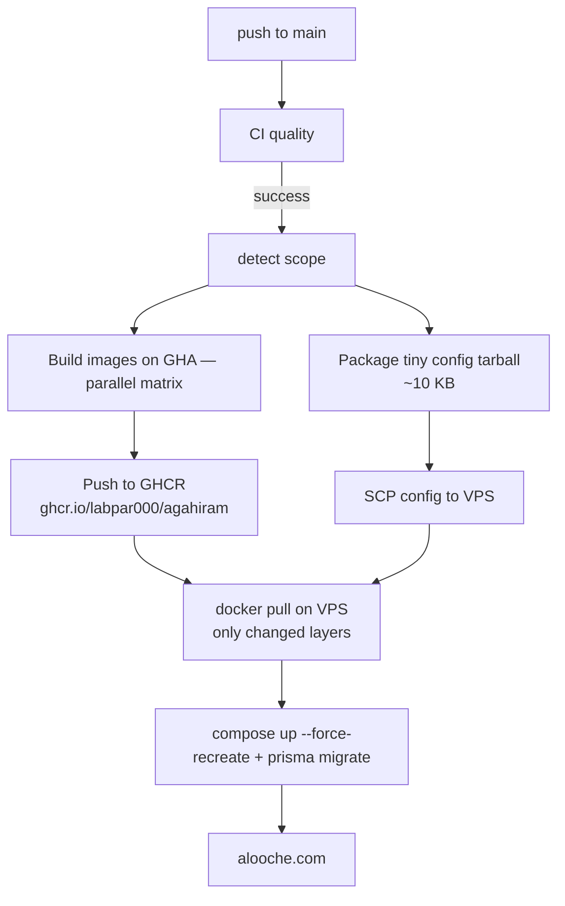

# CI/CD آگهی‌گرام

این سند توضیح می‌دهد GitHub Actions پروژه چه کارهایی انجام می‌دهد و deploy production چگونه کار می‌کند.

**دامنه production:** `alooche.com`

## معماری deploy (فعلی)



| مرحله                              | کجا           | زمان تقریبی |
| ---------------------------------- | ------------- | ----------- |
| CI (format/typecheck/build)        | GitHub runner | ~3 دقیقه    |
| Build + push image (مثلاً فقط web) | GitHub runner | ~3-8 دقیقه  |
| Pull + restart روی VPS             | سرور          | ~1-3 دقیقه  |
| **فقط Caddyfile**                  | سرور          | ~30 ثانیه   |

**دیگر build روی VPS انجام نمی‌شود** — علت اصلی deployهای ۴۵+ دقیقه‌ای و `Broken pipe` برطرف شده است.

**روش pull (نه transfer):** VPS مستقیماً image را از GHCR می‌کشد — فقط لایه‌های تغییر‌یافته دانلود می‌شوند (Docker layer cache). هیچ tarball بزرگی از runner به VPS منتقل نمی‌شود.

## Workflowها

### CI

فایل: [`.github/workflows/ci.yml`](../.github/workflows/ci.yml)

- PR و push به `main`
- `pnpm install --frozen-lockfile` → format → typecheck (بدون `next build` تکراری)

### Deploy Production

فایل: [`.github/workflows/deploy.yml`](../.github/workflows/deploy.yml)

1. **scope** — [`scripts/detect-build-services.sh`](../scripts/detect-build-services.sh) سرویس‌های لازم + `CONFIG_ONLY` (مثلاً فقط caddy)
2. **build** — matrix روی GHA، push به `ghcr.io/labpar000/agahiram/{service}:{sha}`
3. **deploy** — SCP config کوچک (~10KB) + `remote-deploy.sh` در حالت **pull** از GHCR

   سرور مستقیماً image را از GHCR می‌کشد (فقط لایه‌های تغییریافته). در صورت نیاز DNS override از `GHCR_DNS_IP` variable استفاده می‌شود.

## Secrets و Variables

مسیر: `Repository → Settings → Secrets and variables → Actions`

| Secret / Variable         | مقدار                  | توضیح                                                            |
| ------------------------- | ---------------------- | ---------------------------------------------------------------- |
| `SSH_HOST`                | `45.144.18.86`         | IP سرور                                                          |
| `SSH_USER`                | `root`                 |                                                                  |
| `SSH_KEY`                 | private key deploy     |                                                                  |
| `SSH_PORT`                | `22`                   | اختیاری                                                          |
| `GHCR_PULL_TOKEN`         | PAT با `read:packages` | اختیاری؛ اگر خالی باشد `GITHUB_TOKEN` موقت deploy استفاده می‌شود |
| `APP_DIR` (var)           | `/opt/agahiram`        |                                                                  |
| `PRODUCTION_DOMAIN` (var) | `alooche.com`          |                                                                  |
| `GHCR_DNS_IP` (var)       | `87.107.110.109`       | اختیاری؛ اگر سرور به `ghcr.io` دسترسی ندارد — DNS override       |

> **نکته GHCR_DNS_IP:** اگر VPS نمی‌تواند به `ghcr.io` متصل شود، مقدار `87.107.110.109` را به عنوان variable (نه secret) ست کنید. `remote-deploy.sh` این IP را در `/etc/hosts` اضافه می‌کند.

### ست کردن SSH deploy key

```powershell
powershell -ExecutionPolicy Bypass -File scripts/bootstrap-github-deploy.ps1
```

### GHCR روی سرور (یک‌بار)

```bash
ssh root@45.144.18.86
GHCR_TOKEN=<pat_with_read_packages> SKIP_PULL_TEST=1 bash /opt/agahiram/scripts/setup-ghcr-server.sh
```

یا [`scripts/setup-ghcr-server.sh`](../scripts/setup-ghcr-server.sh) — بعد از اولین push موفق imageها به GHCR.

**Package visibility:** در GitHub → Packages → هر package → Change visibility به **public** (یا PAT با read:packages نگه دارید).

## اسکریپت‌های deploy

| اسکریپت                                                                   | کاربرد                                      |
| ------------------------------------------------------------------------- | ------------------------------------------- |
| [`scripts/remote-deploy.sh`](../scripts/remote-deploy.sh)                 | pull mode (پیش‌فرض) + build mode (fallback) |
| [`scripts/detect-build-services.sh`](../scripts/detect-build-services.sh) | تشخیص scope از git diff                     |
| [`scripts/package-config.sh`](../scripts/package-config.sh)               | tarball کوچک docker/ + scripts/             |
| [`scripts/update.sh`](../scripts/update.sh)                               | git pull + pull images (بدون build روی VPS) |
| [`scripts/deploy-bridge.ps1`](../scripts/deploy-bridge.ps1)               | deploy دستی از Windows                      |
| [`docker/docker-compose.build.yml`](../docker/docker-compose.build.yml)   | build محلی / fallback                       |

### Deploy دستی از PC

```powershell
# pull mode (پیش‌فرض — سریع، بعد از push به GHCR)
powershell -ExecutionPolicy Bypass -File scripts/deploy-bridge.ps1 -SkipLocalChecks

# build روی سرور (فقط emergency)
powershell -ExecutionPolicy Bypass -File scripts/deploy-bridge.ps1 -SkipLocalChecks -BuildOnServer
```

### Deploy از GitHub UI

`Actions → Deploy Production → Run workflow`

## Rollback

```bash
ssh root@45.144.18.86
cd /opt/agahiram/docker
export IMAGE_TAG=<commit-sha-قبلی>
docker compose -f docker-compose.prod.yml pull api web admin worker
docker compose -f docker-compose.prod.yml up -d --force-recreate api web admin worker caddy
```

## عیب‌یابی

| علامت                                 | علت                           | راه‌حل                                                                              |
| ------------------------------------- | ----------------------------- | ----------------------------------------------------------------------------------- |
| `manifest unknown` / timeout روی pull | DNS یا image ساخته نشده       | DNS `87.107.110.109`؛ `GHCR_PULL_TOKEN`؛ fallback به `latest` در `remote-deploy.sh` |
| `reused 0` در pnpm داخل build VPS     | مدل قدیمی build روی سرور      | از CI deploy استفاده کنید، نه build روی VPS                                         |
| `Broken pipe` در Actions              | SSH طولانی                    | با pull mode برطرف شده؛ `ServerAliveInterval` فعال است                              |
| `Unexpected EOF` در tar               | tarball ناقص / deploy هم‌زمان | upload اتمیک `.tmp` + `flock` lock                                                  |
| `pull access denied`                  | GHCR private                  | `setup-ghcr-server.sh` یا public package                                            |
| deploy گیر کرده                       | build قدیمی روی سرور          | `pkill -f 'docker compose.*build'` سپس redeploy                                     |

لاگ deploy روی سرور: `/tmp/agahiram-deploy.log` — وضعیت: `/tmp/agahiram-deploy.status`

## نکات امنیتی

- private key deploy فقط در GitHub Secrets — **commit نشود**
- `.env` production روی سرور — commit نشود
- `GHCR_PULL_TOKEN` فقط `read:packages` (نه write)
